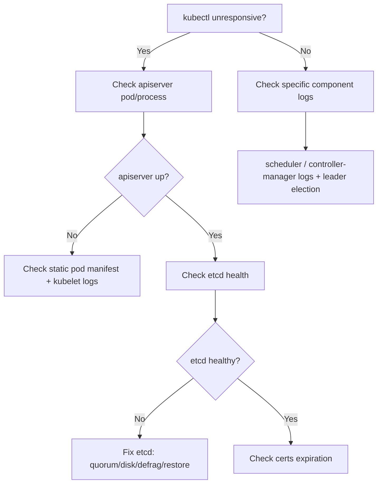

# Kubernetes Control Plane Generic Issues Guide

The control plane consists of `kube-apiserver`, `etcd`, `kube-scheduler`, `kube-controller-manager`, and `cloud-controller-manager`. Here's how to diagnose and fix common issues.

## Quick Health Check

```bash
# Overall component status
kubectl get componentstatuses          # (deprecated but still useful)
kubectl get --raw='/readyz?verbose'    # API server readiness breakdown
kubectl get --raw='/livez?verbose'     # API server liveness

# Control plane pods (kubeadm/static pods)
kubectl get pods -n kube-system
kubectl get nodes -o wide

# Static pod manifests location
ls /etc/kubernetes/manifests/
```

---

## General Diagnostic Workflow



## Most Useful Commands to Remember

```bash
kubectl get --raw='/readyz?verbose'        # granular API health
kubectl get events -A --sort-by=.lastTimestamp
crictl ps -a                                # container runtime view of pods
journalctl -u kubelet -f                    # kubelet is what runs static pods
kubeadm certs check-expiration              # cert health
e endpoint status -w table                  # etcd leader/size
```

---

## 1. kube-apiserver Issues

**Symptoms:** `kubectl` hangs/timeouts, `connection refused`, `Unable to connect to the server`.

| Cause | Diagnosis | Fix |
|-------|-----------|-----|
| API server down | `crictl ps -a \| grep apiserver`, `journalctl -u kubelet` | Check `/etc/kubernetes/manifests/kube-apiserver.yaml`, fix flags |
| Cert expired | `kubeadm certs check-expiration` | `kubeadm certs renew all`, restart static pods |
| etcd unreachable | apiserver logs show `etcdserver` errors | Fix etcd first (see below) |
| Wrong kubeconfig | `kubectl config view` | Point to correct cluster/context |
| Port/firewall | `curl -k https://<ip>:6443/healthz` | Open 6443 |

```bash
# View apiserver logs (static pod)
crictl logs $(crictl ps -a --name kube-apiserver -q | head -1)
# or
journalctl -u kubelet -f
```

---

## 2. etcd Issues (most critical)

**Symptoms:** API server errors, `etcdserver: request timed out`, slow cluster, write failures.

```bash
# Set up etcdctl against the cluster
export ETCDCTL_API=3
alias e='etcdctl --endpoints=https://127.0.0.1:2379 \
  --cacert=/etc/kubernetes/pki/etcd/ca.crt \
  --cert=/etc/kubernetes/pki/etcd/server.crt \
  --key=/etc/kubernetes/pki/etcd/server.key'

e endpoint health          # health of each member
e endpoint status -w table # leader, DB size, raft index
e member list -w table     # cluster membership
e alarm list               # NOSPACE / CORRUPT alarms
```

**Common problems:**
- **`mvcc: database space exceeded`** → DB hit quota (default 2GB). Defrag + disarm alarm:
  ```bash
  e defrag
  e alarm disarm
  ```
- **Slow disk / high latency** → etcd needs low-latency SSD (`wal_fsync_duration`, `backend_commit_duration` metrics). Move etcd to faster disk.
- **Lost quorum** (odd number of members; majority must be up) → restore from snapshot.
- **Clock skew** between members → sync NTP.

**Backup & restore:**
```bash
e snapshot save /backup/etcd-snapshot.db
e snapshot restore /backup/etcd-snapshot.db --data-dir=/var/lib/etcd-restore
# Then update etcd static pod to point at restored data-dir
```

---

## 3. kube-scheduler Issues

**Symptoms:** Pods stuck in `Pending`, never scheduled.

```bash
kubectl get pods -n kube-system | grep scheduler
kubectl describe pod <pending-pod>   # check Events for scheduling reason
crictl logs $(crictl ps --name kube-scheduler -q)
```

Common causes: insufficient resources, node taints, affinity/anti-affinity rules, no nodes `Ready`, scheduler crashed (leader election failing).

---

## 4. kube-controller-manager Issues

**Symptoms:** Deployments don't scale, endpoints not updated, nodes not cleaned up, PVCs not bound.

```bash
crictl logs $(crictl ps --name kube-controller-manager -q)
# Check leader election
kubectl -n kube-system get lease
```

Common causes: cert issues, leader election failing, cloud provider misconfig, RBAC for service account.

---

## 5. Certificate Problems (frequent in kubeadm clusters)

```bash
kubeadm certs check-expiration
kubeadm certs renew all
# Restart static pods after renewal (move manifests out and back, or):
crictl rm $(crictl ps -a -q --name 'kube-apiserver|controller-manager|scheduler|etcd')
# Refresh admin kubeconfig if needed
kubeadm init phase kubeconfig admin
```

---

## 6. Node / kubelet Affecting Control Plane

```bash
systemctl status kubelet
journalctl -u kubelet -f
kubectl describe node <control-plane-node>   # check conditions, pressure, taints
```

Watch for `DiskPressure`, `MemoryPressure`, `NetworkUnavailable`, or `NotReady`.

---
