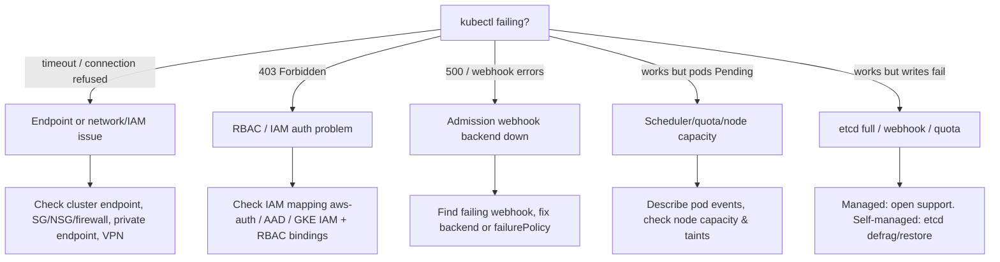
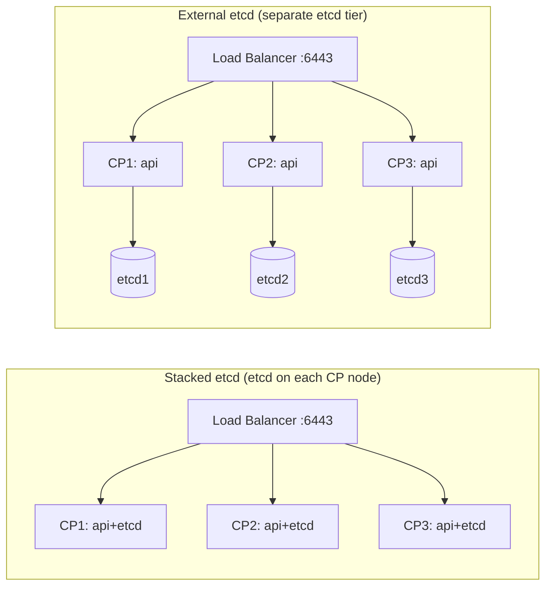

# Kubernetes Control Plane Troubleshooting Guide

> Focus: **Managed clusters (EKS / AKS / GKE)** with notes for self-managed (kubeadm) where the control plane is yours to fix.

---

## 0. Mental Model: What You Own vs What the Provider Owns

On **managed offerings the control plane is run by the cloud provider**. You generally **cannot** SSH to the API server or etcd, edit static pod manifests, or run `etcdctl`. Your job shifts to:

- Reading **control plane logs** the provider exposes.
- Checking the **managed control plane health/SLA** status.
- Fixing **what you control**: nodes, networking, IAM/RBAC, webhooks, CRDs, quotas, add-ons.

| Component | EKS | AKS | GKE | Self-managed (kubeadm) |
|-----------|-----|-----|-----|------------------------|
| apiserver / etcd / scheduler / controller-manager | Provider-managed | Provider-managed | Provider-managed | **You manage** |
| Control plane logs | CloudWatch (opt-in) | Azure Monitor / Diagnostic settings | Cloud Logging | journald / static pod logs |
| etcd access | No | No | No | Yes (`etcdctl`) |
| Nodes, CNI, RBAC, webhooks | You | You | You | You |

> **Key insight:** On managed clusters, ~90% of "control plane" incidents are actually **admission webhooks, RBAC/IAM, CRDs, networking, or node** problems that *manifest* as API errors — not the provider's control plane being broken.

---

## 1. First 5 Minutes — Triage

```bash
# Is the API reachable and healthy?
kubectl version --short
kubectl get --raw='/readyz?verbose'      # granular API server readiness
kubectl get --raw='/livez?verbose'

# Cluster-wide signal
kubectl get nodes -o wide
kubectl get events -A --sort-by=.lastTimestamp | tail -40
kubectl get apiservices | grep -v True    # broken aggregated APIs (metrics-server etc.)

# Are admission webhooks blocking writes?
kubectl get validatingwebhookconfigurations
kubectl get mutatingwebhookconfigurations
```

**Decision tree:**



---

## 2. Managed Control Plane — Provider-Specific Checks

### EKS (AWS)

```bash
# Cluster status & endpoint config
aws eks describe-cluster --name <cluster> \
  --query 'cluster.{status:status,endpoint:endpoint,version:version,access:resourcesVpcConfig.endpointPublicAccess}'

# Enable control plane logging (api, audit, authenticator, controllerManager, scheduler)
aws eks update-cluster-config --name <cluster> \
  --logging '{"clusterLogging":[{"types":["api","audit","authenticator","controllerManager","scheduler"],"enabled":true}]}'

# Then query in CloudWatch Logs Insights:
#   log group: /aws/eks/<cluster>/cluster
```

Common EKS control-plane-adjacent issues:
- **`Unauthorized` / `403`** → IAM identity not mapped. Check the `aws-auth` ConfigMap or **EKS Access Entries**.
- **`Unable to connect`** → private endpoint with no route from your network (VPN/peering/SG).
- **Webhook timeouts** → security group blocks API server → webhook pod traffic.
- **Node `NotReady`** → CNI (VPC CNI) IP exhaustion, IAM role on node, or `aws-node` DaemonSet failing.

### AKS (Azure)

```bash
az aks show -g <rg> -n <cluster> \
  --query '{power:powerState.code,provisioning:provisioningState,version:kubernetesVersion,private:apiServerAccessProfile.enablePrivateCluster}'

# Run AKS diagnostics
az aks check-acr ...        # ACR connectivity
# Diagnose & Solve Problems blade in Portal; enable Diagnostic Settings -> Log Analytics
# kube-apiserver / kube-audit / cluster-autoscaler / kube-scheduler logs go to Log Analytics
```

Common AKS issues:
- **Stopped cluster** → `powerState=Stopped`; `az aks start -g <rg> -n <cluster>`.
- **Private cluster unreachable** → must use jumpbox/Bastion/`az aks command invoke`.
- **AAD/RBAC `Forbidden`** → check Azure RBAC vs Kubernetes RBAC mode and role assignments.
- **`az aks command invoke`** lets you run kubectl from inside the managed network:
  ```bash
  az aks command invoke -g <rg> -n <cluster> -c "kubectl get nodes"
  ```

### GKE (Google)

```bash
gcloud container clusters describe <cluster> --region <region> \
  --format='value(status, currentMasterVersion, privateClusterConfig.enablePrivateEndpoint)'

# Control plane logs are in Cloud Logging:
#   resource.type="k8s_control_plane_component"
```

Common GKE issues:
- **Master upgrade in progress** → API may be briefly unavailable; check operations: `gcloud container operations list`.
- **Authorized networks** blocking your IP → add your CIDR to master authorized networks.
- **Private cluster** → needs Cloud NAT / proxy / authorized network for kubectl.
- **`Forbidden`** → Google IAM role + Kubernetes RBAC both required.

---

## 3. etcd Disaster Recovery (Self-Managed Only)

> Managed clusters: **you cannot do this** — etcd is provider-run. Open a support ticket. The section below is for **kubeadm/self-managed** control planes.

### Setup etcdctl

```bash
export ETCDCTL_API=3
alias e='etcdctl --endpoints=https://127.0.0.1:2379 \
  --cacert=/etc/kubernetes/pki/etcd/ca.crt \
  --cert=/etc/kubernetes/pki/etcd/server.crt \
  --key=/etc/kubernetes/pki/etcd/server.key'

e endpoint health
e endpoint status -w table     # leader, raft index, DB size
e member list -w table
e alarm list
```

### Take a backup (do this on a schedule!)

```bash
e snapshot save /backup/etcd-$(date +%F-%H%M).db
e snapshot status /backup/etcd-*.db -w table   # verify hash/size
```

### Database full: `mvcc: database space exceeded`

```bash
e alarm list                   # shows NOSPACE
e defrag                       # reclaim space (per member)
e alarm disarm                 # clear the alarm
# Long term: raise --quota-backend-bytes and tune --auto-compaction-retention
```

### Restore from snapshot (full cluster recovery)

```bash
# 1. Stop control plane on all CP nodes (move manifests out)
mv /etc/kubernetes/manifests/*.yaml /tmp/

# 2. Restore on each member (use that member's name/peer URL)
etcdctl snapshot restore /backup/etcd-snapshot.db \
  --name=<member-name> \
  --initial-cluster=<m1>=https://<ip1>:2380,<m2>=https://<ip2>:2380,<m3>=https://<ip3>:2380 \
  --initial-advertise-peer-urls=https://<this-ip>:2380 \
  --data-dir=/var/lib/etcd-restore

# 3. Point etcd static pod at the new data-dir, restore manifests
#    edit /etc/kubernetes/manifests/etcd.yaml -> hostPath = /var/lib/etcd-restore
mv /tmp/*.yaml /etc/kubernetes/manifests/

# 4. Verify
e endpoint health
kubectl get nodes
```

### Quorum loss

- etcd needs a **majority** of members up: 3 members tolerate 1 failure, 5 tolerate 2.
- If majority is permanently lost → restore from snapshot to a **new single-member** cluster, then re-add members.
- Always run an **odd** number of members (3 or 5). Never 2 or 4.

---

## 4. HA Control Plane Failover

### Topologies



- **Stacked**: simpler, fewer machines; losing a node loses an apiserver **and** an etcd member.
- **External**: etcd isolated from apiserver load; more resilient, more machines to run.

### Load balancer in front of apiservers

- Health-check each apiserver on `GET /readyz` (TCP check on 6443 is not enough — a process can listen but be unhealthy).
- Clients/kubeconfig point at the **LB VIP/DNS**, never an individual node.
- Ensure the LB removes an unhealthy apiserver within seconds.

### Leader election (scheduler & controller-manager)

Only **one** scheduler and **one** controller-manager are active at a time via leases:

```bash
kubectl -n kube-system get lease kube-scheduler kube-controller-manager -o wide
# Watch holderIdentity change during failover
kubectl -n kube-system get lease kube-controller-manager -o jsonpath='{.spec.holderIdentity}{"\n"}'
```

If failover is slow, check `--leader-elect-lease-duration`, `--leader-elect-renew-deadline`, and clock skew (NTP) across nodes.

### Failover drill checklist

1. Confirm `kubectl get nodes` and `/readyz` healthy on all 3 CP nodes.
2. Cordon/drain or stop apiserver on CP1.
3. Verify LB routes only to CP2/CP3; `kubectl` still works.
4. Confirm scheduler/controller leases moved off CP1.
5. Restore CP1; verify it rejoins (etcd member healthy, apiserver `/readyz` ok).

---

## 5. Common "It Looks Like the Control Plane" — But Isn't

| Symptom | Real cause | Check |
|---------|-----------|-------|
| `Error from server (InternalError): ... webhook ... timeout` | Admission webhook backend pod down | `kubectl get validating/mutatingwebhookconfigurations`; fix backend or `failurePolicy: Ignore` |
| All writes fail, reads ok | etcd full (self-mgd) / quota / webhook | `e alarm list`; resource quotas |
| `kubectl` slow then `429 Too Many Requests` | API priority & fairness throttling | `kubectl get --raw '/metrics' \| grep apiserver_flowcontrol` |
| `metrics-server`/custom metrics 503 | Broken APIService aggregation | `kubectl get apiservices \| grep -v True` |
| Pods stuck `Pending` | Scheduler can't place (quota/taints/capacity) | `kubectl describe pod`; node taints & requests |
| `Unauthorized` / `Forbidden` | IAM ↔ RBAC mapping | aws-auth / AAD / GKE IAM + RoleBindings |
| Node `NotReady`, control plane "flaky" | CNI / kubelet / disk pressure | `kubectl describe node`; kubelet logs |

```bash
# Find a misbehaving webhook fast
for w in $(kubectl get validatingwebhookconfigurations -o name); do
  echo "== $w =="; kubectl get $w -o jsonpath='{range .webhooks[*]}{.name}{"\t"}{.clientConfig.service.namespace}/{.clientConfig.service.name}{"\t"}{.failurePolicy}{"\n"}{end}'
done
```

---

## 6. Certificates (Self-Managed)

```bash
kubeadm certs check-expiration
kubeadm certs renew all
# Restart static pods after renewal
crictl rm $(crictl ps -a -q --name 'kube-apiserver|controller-manager|scheduler|etcd')
kubeadm init phase kubeconfig admin      # refresh admin kubeconfig
```

Managed: certs are rotated by the provider; if a kubelet client cert expires on a node, the node goes `NotReady` — recycle the node.

---

## 7. Commands to Keep Handy

```bash
kubectl get --raw='/readyz?verbose'              # granular API health
kubectl get --raw='/healthz/etcd'                # etcd connectivity from apiserver
kubectl get events -A --sort-by=.lastTimestamp   # recent cluster events
kubectl get apiservices | grep -v True           # broken aggregated APIs
kubectl -n kube-system get lease                 # leader election state
kubectl get validatingwebhookconfigurations      # admission gates on writes

# Self-managed only
crictl ps -a                                     # runtime view of static pods
journalctl -u kubelet -f                         # kubelet runs static pods
e endpoint status -w table                       # etcd leader/size/health
kubeadm certs check-expiration                   # cert health
```

---

## 8. Escalation

- **Managed (EKS/AKS/GKE):** if `/readyz` is failing, control plane shows degraded, or etcd-side errors appear and **nothing you own explains it** → open a provider support case with cluster name, region, timestamps, and the failing `kubectl get --raw='/readyz?verbose'` output.
- **Self-managed:** capture `e endpoint status`, apiserver/etcd logs, and `kubeadm certs check-expiration` before making changes; take an etcd snapshot before any destructive action.
